# unproc screenshots

From `e86eac5` — 2026-09-30 20:22 UTC — simulator demo feed.

### 01-camera

### 02-after-shot

### 03-menu
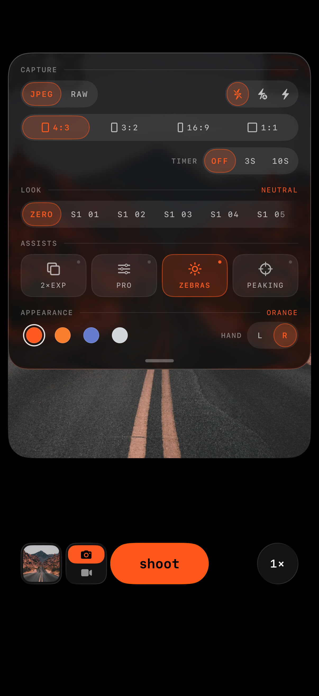

### 04-menu-look-raw

### 05-look-applied

### 06-look-swipe-1

### 06-look-swipe-2
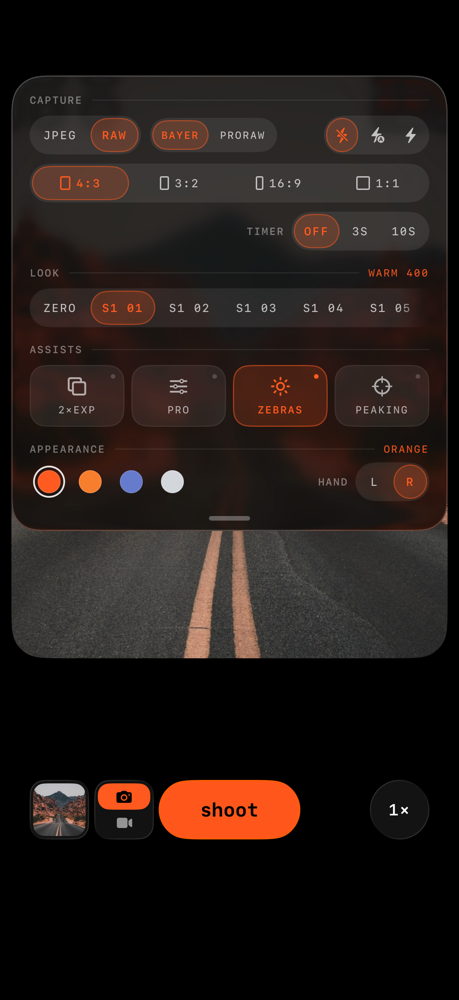

### 06-look-swipe-3

### 16-zoom-scrub-in

### 17-zoom-after-scrub
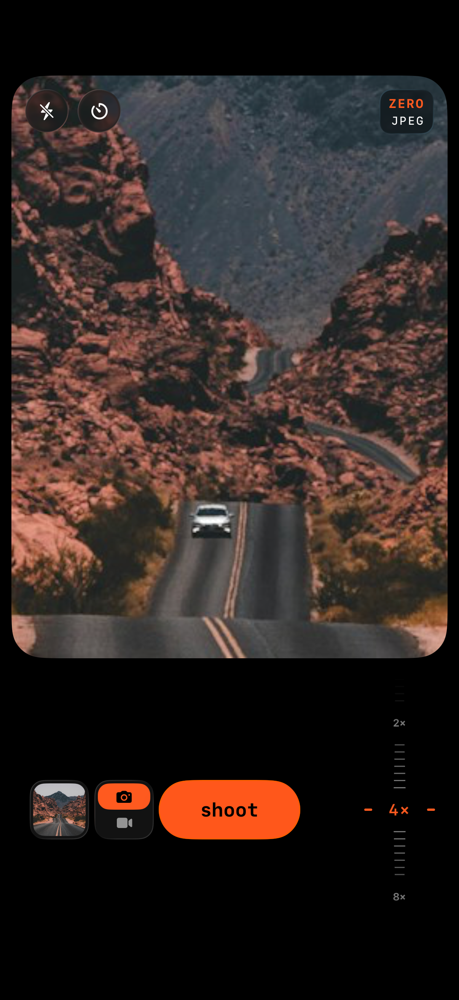

### 18-zoom-force-selfie
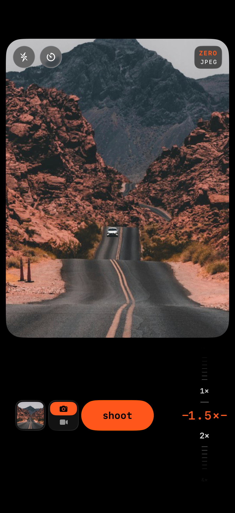

### 19-selfie
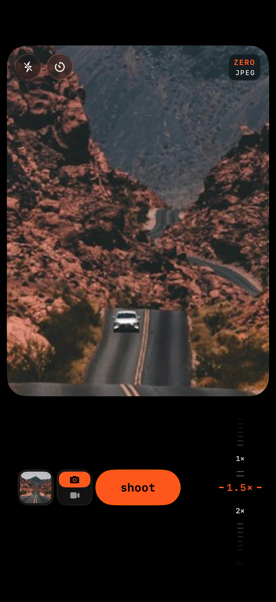

### 20-video-mode
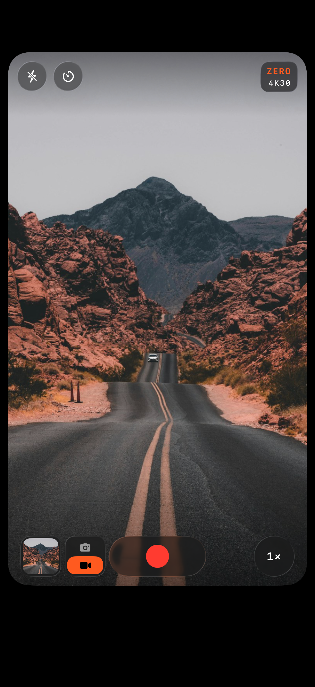

### 20-zoom-ruler-16x9
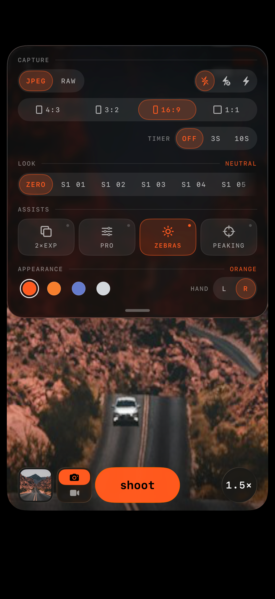

### 21-recording
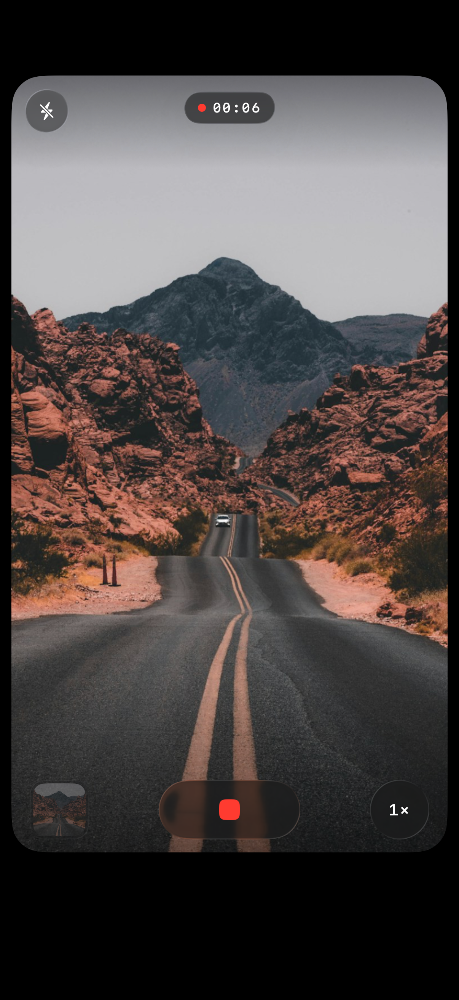

### 22-video-viewer
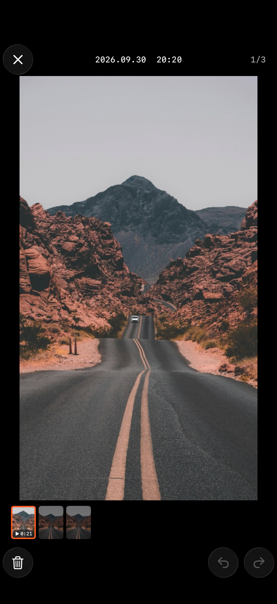

### 23-timer
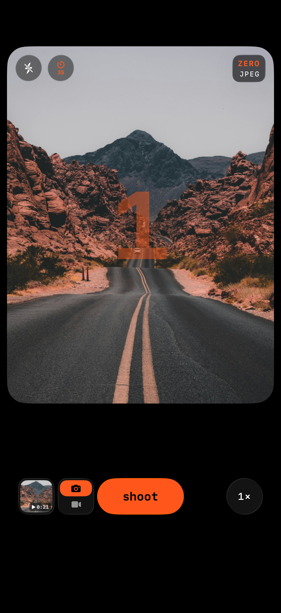

### 24-timer-off
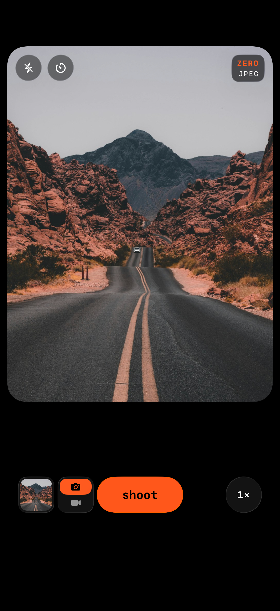

### P1-saved-jpeg
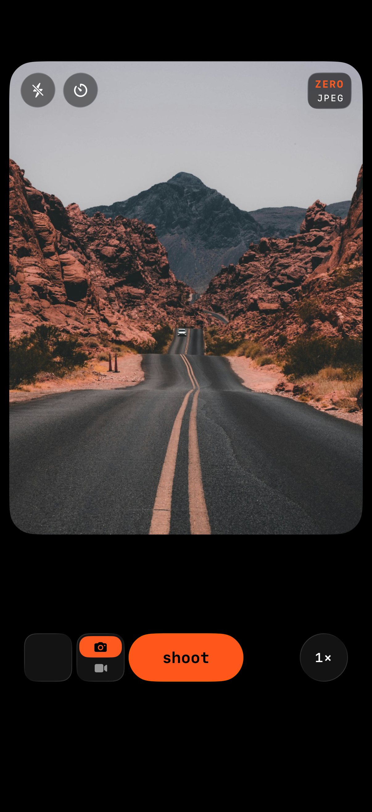

### P2-saved-raw

### P3-viewer-photos
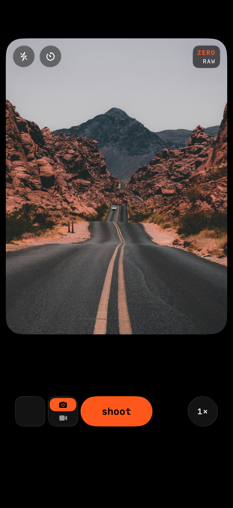

